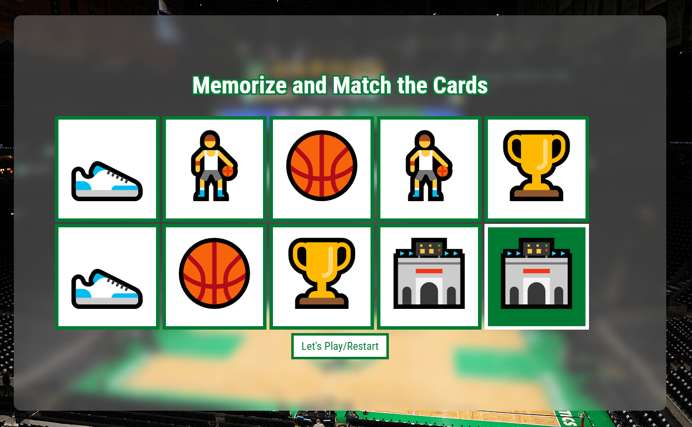

# Memory Game

A 10-card memory matching game built with vanilla JavaScript.
Flip two cards at a time and try to find all the matching pairs.

## Features
- 10 cards (5 matching pairs) laid out face down
- Select two cards to check if they match
- Matched cards stay flipped over
- Non-matching cards flip back over
- Game ends when all cards are matched and flipped

## Built With
- HTML, CSS, JavaScript

## How to Play
1. Click a card to flip it over
2. Click a second card to try to find its match
3. If they match, they stay face up
4. If not, they flip back over after a short delay
5. Match all 5 pairs to win
